# Contract Flows

Covers implemented contracts: **Identity**, **Medical Record**, and **Access Broker** (schema, record registration, normal grants, request_access predicate).
Remaining contracts (Prescription, Supply Chain, Incentive) are stubs pending implementation.

---

## Architecture Overview

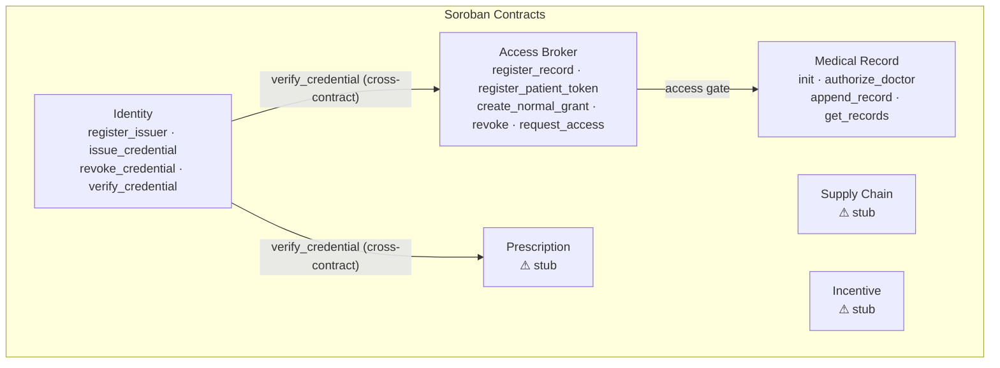
```mermaid
graph TB
    subgraph Soroban["Soroban Contracts"]
        ID["Identity\nregister_issuer · issue_credential\nrevoke_credential · verify_credential"]
        MR["Medical Record\ninit · authorize_doctor\nappend_record · get_records"]
        AB["Access Broker\nregister_record · register_patient_token\ncreate_normal_grant · revoke · request_access"]
        RX["Prescription\n⚠ stub"]
        SC["Supply Chain\n⚠ stub"]
        IN["Incentive\n⚠ stub"]
    end

    ID -->|"verify_credential (cross-contract)"| AB
    ID -->|"verify_credential (cross-contract)"| RX
    AB -->|"access gate"| MR
```

---

## Identity Contract

### Data Model

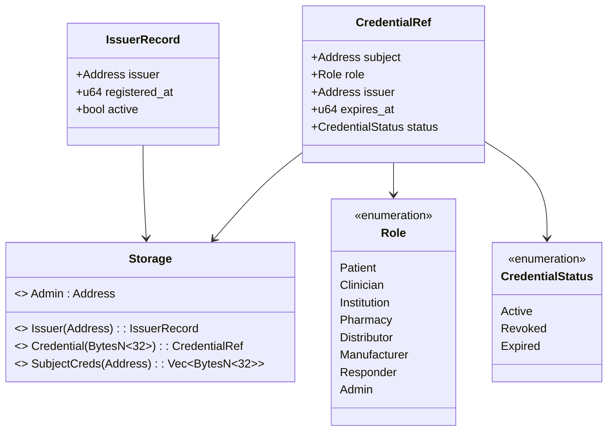
```mermaid
classDiagram
    class IssuerRecord {
        +Address issuer
        +u64 registered_at
        +bool active
    }

    class CredentialRef {
        +Address subject
        +Role role
        +Address issuer
        +u64 expires_at
        +CredentialStatus status
    }

    class Role {
        <<enumeration>>
        Patient
        Clinician
        Institution
        Pharmacy
        Distributor
        Manufacturer
        Responder
        Admin
    }

    class CredentialStatus {
        <<enumeration>>
        Active
        Revoked
        Expired
    }

    class Storage {
        <<instance>> Admin : Address
        <<persistent>> Issuer(Address) : IssuerRecord
        <<persistent>> Credential(BytesN~32~) : CredentialRef
        <<persistent>> SubjectCreds(Address) : Vec~BytesN~32~~
    }

    CredentialRef --> Role
    CredentialRef --> CredentialStatus
    IssuerRecord --> Storage
    CredentialRef --> Storage
```

### Bootstrap & Issuer Registration

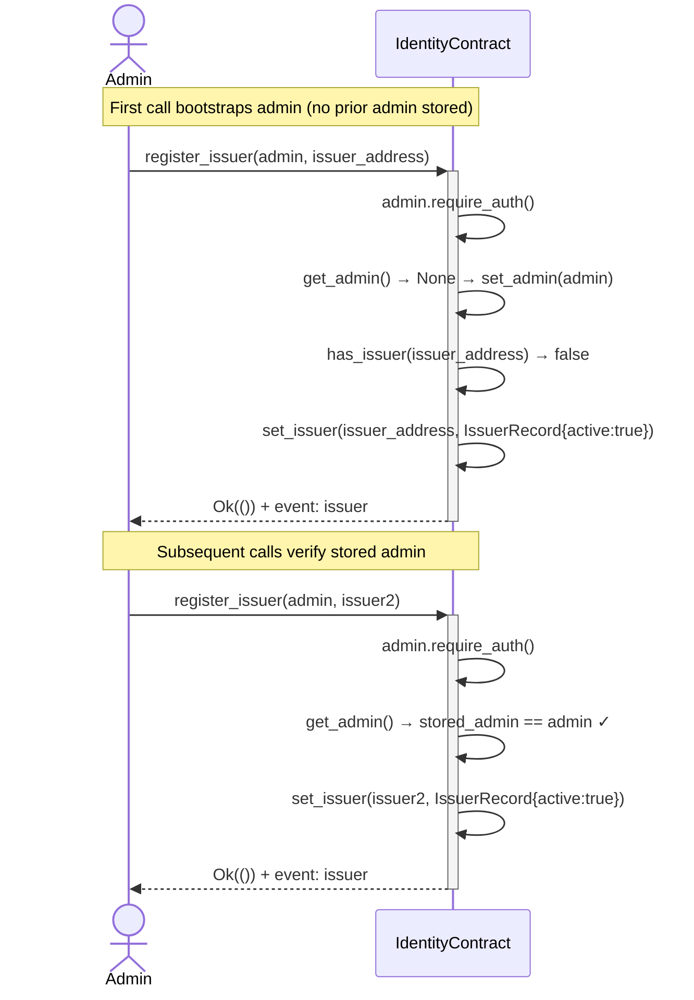
```mermaid
sequenceDiagram
    actor Admin
    participant ID as IdentityContract

    Note over Admin,ID: First call bootstraps admin (no prior admin stored)
    Admin->>+ID: register_issuer(admin, issuer_address)
    ID->>ID: admin.require_auth()
    ID->>ID: get_admin() → None → set_admin(admin)
    ID->>ID: has_issuer(issuer_address) → false
    ID->>ID: set_issuer(issuer_address, IssuerRecord{active:true})
    ID-->>-Admin: Ok(()) + event: issuer

    Note over Admin,ID: Subsequent calls verify stored admin
    Admin->>+ID: register_issuer(admin, issuer2)
    ID->>ID: admin.require_auth()
    ID->>ID: get_admin() → stored_admin == admin ✓
    ID->>ID: set_issuer(issuer2, IssuerRecord{active:true})
    ID-->>-Admin: Ok(()) + event: issuer
```

### Credential Issuance

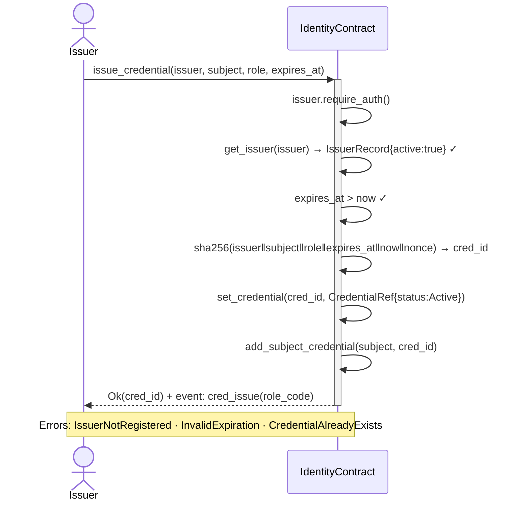
```mermaid
sequenceDiagram
    actor Issuer
    participant ID as IdentityContract

    Issuer->>+ID: issue_credential(issuer, subject, role, expires_at)
    ID->>ID: issuer.require_auth()
    ID->>ID: get_issuer(issuer) → IssuerRecord{active:true} ✓
    ID->>ID: expires_at > now ✓
    ID->>ID: sha256(issuer‖subject‖role‖expires_at‖now‖nonce) → cred_id
    ID->>ID: set_credential(cred_id, CredentialRef{status:Active})
    ID->>ID: add_subject_credential(subject, cred_id)
    ID-->>-Issuer: Ok(cred_id) + event: cred_issue(role_code)

    Note over Issuer,ID: Errors: IssuerNotRegistered · InvalidExpiration · CredentialAlreadyExists
```

### Credential Verification

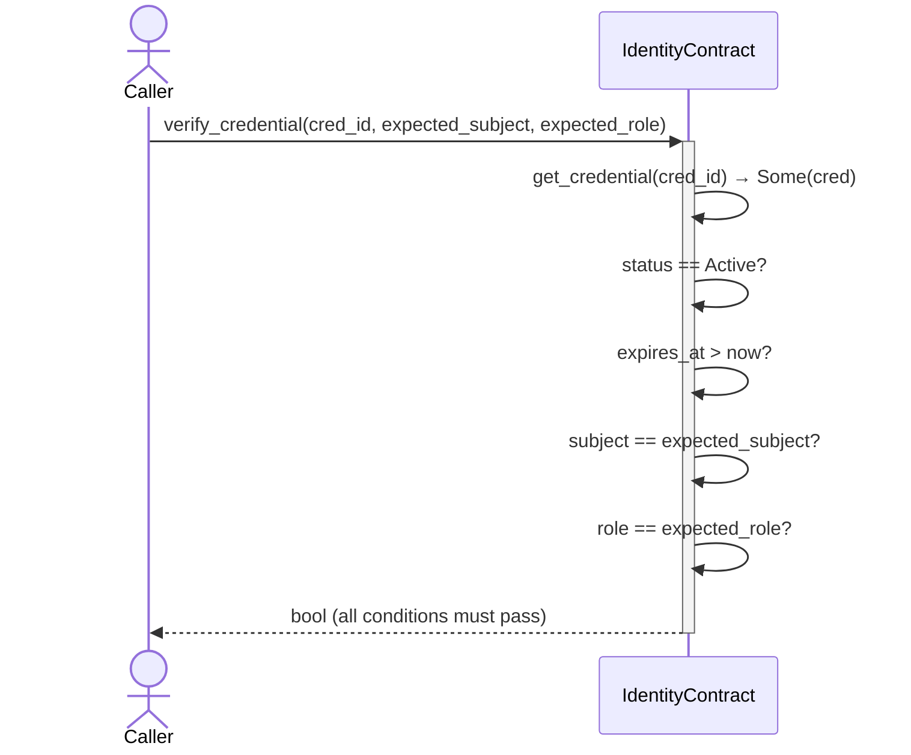
```mermaid
sequenceDiagram
    actor Caller
    participant ID as IdentityContract

    Caller->>+ID: verify_credential(cred_id, expected_subject, expected_role)
    ID->>ID: get_credential(cred_id) → Some(cred)
    ID->>ID: status == Active?
    ID->>ID: expires_at > now?
    ID->>ID: subject == expected_subject?
    ID->>ID: role == expected_role?
    ID-->>-Caller: bool (all conditions must pass)
```

### Credential Revocation

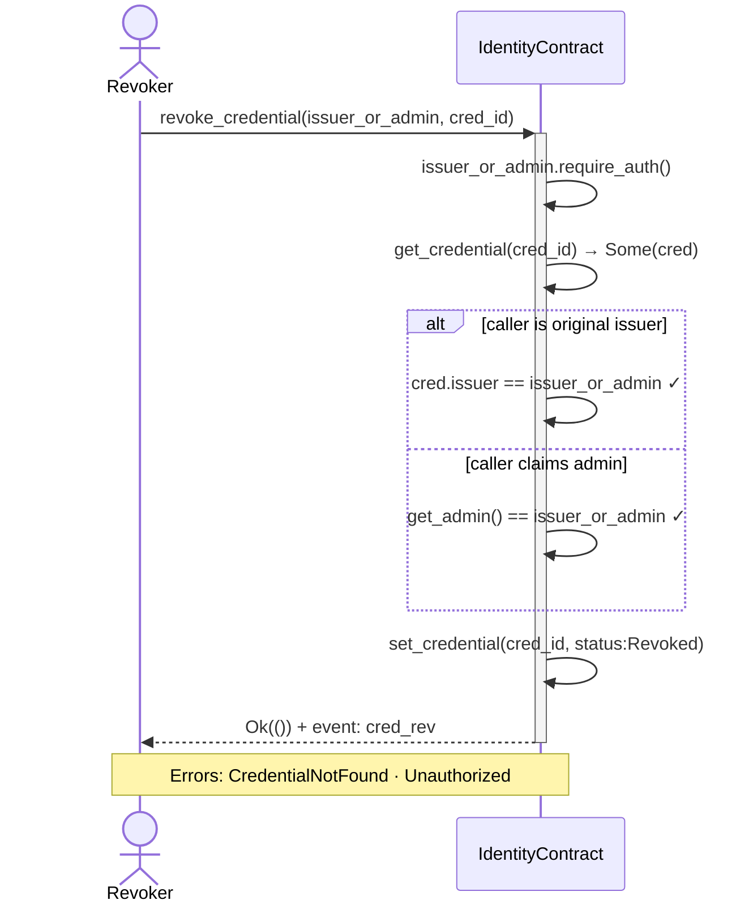
```mermaid
sequenceDiagram
    actor Revoker
    participant ID as IdentityContract

    Revoker->>+ID: revoke_credential(issuer_or_admin, cred_id)
    ID->>ID: issuer_or_admin.require_auth()
    ID->>ID: get_credential(cred_id) → Some(cred)
    alt caller is original issuer
        ID->>ID: cred.issuer == issuer_or_admin ✓
    else caller claims admin
        ID->>ID: get_admin() == issuer_or_admin ✓
    end
    ID->>ID: set_credential(cred_id, status:Revoked)
    ID-->>-Revoker: Ok(()) + event: cred_rev

    Note over Revoker,ID: Errors: CredentialNotFound · Unauthorized
```

---

## Medical Record Contract

### Data Model

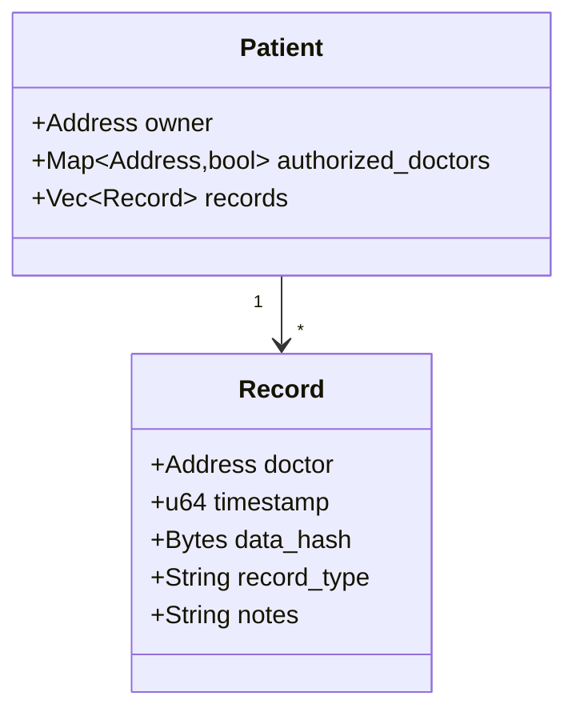
```mermaid
classDiagram
    class Patient {
        +Address owner
        +Map~Address,bool~ authorized_doctors
        +Vec~Record~ records
    }

    class Record {
        +Address doctor
        +u64 timestamp
        +Bytes data_hash
        +String record_type
        +String notes
    }

    Patient "1" --> "*" Record
```

### Patient Initialisation & Doctor Access

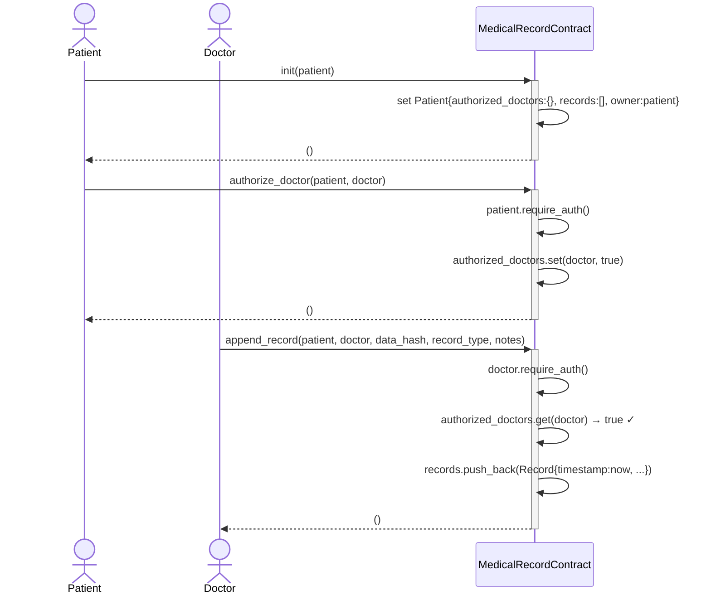
```mermaid
sequenceDiagram
    actor Patient
    actor Doctor
    participant MR as MedicalRecordContract

    Patient->>+MR: init(patient)
    MR->>MR: set Patient{authorized_doctors:{}, records:[], owner:patient}
    MR-->>-Patient: ()

    Patient->>+MR: authorize_doctor(patient, doctor)
    MR->>MR: patient.require_auth()
    MR->>MR: authorized_doctors.set(doctor, true)
    MR-->>-Patient: ()

    Doctor->>+MR: append_record(patient, doctor, data_hash, record_type, notes)
    MR->>MR: doctor.require_auth()
    MR->>MR: authorized_doctors.get(doctor) → true ✓
    MR->>MR: records.push_back(Record{timestamp:now, ...})
    MR-->>-Doctor: ()
```

### Doctor Revocation & Record Query

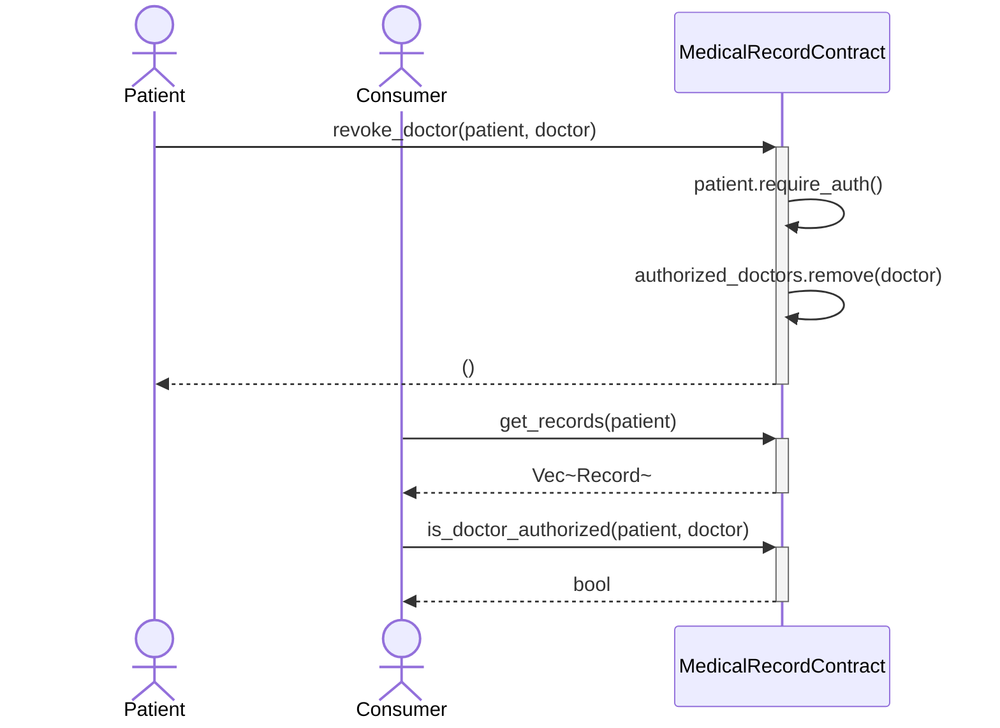
```mermaid
sequenceDiagram
    actor Patient
    actor Consumer
    participant MR as MedicalRecordContract

    Patient->>+MR: revoke_doctor(patient, doctor)
    MR->>MR: patient.require_auth()
    MR->>MR: authorized_doctors.remove(doctor)
    MR-->>-Patient: ()

    Consumer->>+MR: get_records(patient)
    MR-->>-Consumer: Vec~Record~

    Consumer->>+MR: is_doctor_authorized(patient, doctor)
    MR-->>-Consumer: bool
```

---

## Access Broker Contract

> BKR-1 (schema), BKR-2 (record registration), BKR-3 (normal grants), BKR-4 (request_access predicate) implemented.
> BKR-5 through BKR-8 (break-glass, offline audit, etc.) pending.

### Data Model

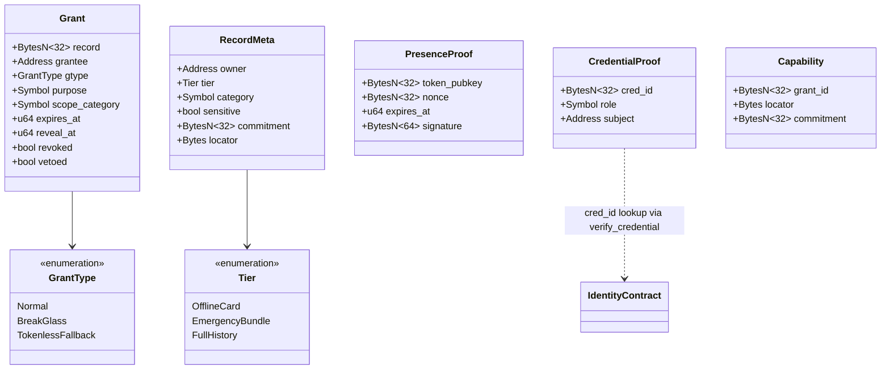
```mermaid
classDiagram
    class Grant {
        +BytesN~32~ record
        +Address grantee
        +GrantType gtype
        +Symbol purpose
        +Symbol scope_category
        +u64 expires_at
        +u64 reveal_at
        +bool revoked
        +bool vetoed
    }

    class RecordMeta {
        +Address owner
        +Tier tier
        +Symbol category
        +bool sensitive
        +BytesN~32~ commitment
        +Bytes locator
    }

    class PresenceProof {
        +BytesN~32~ token_pubkey
        +BytesN~32~ nonce
        +u64 expires_at
        +BytesN~64~ signature
    }

    class CredentialProof {
        +BytesN~32~ cred_id
        +Symbol role
        +Address subject
    }

    class Capability {
        +BytesN~32~ grant_id
        +Bytes locator
        +BytesN~32~ commitment
    }

    class Tier {
        <<enumeration>>
        OfflineCard
        EmergencyBundle
        FullHistory
    }

    class GrantType {
        <<enumeration>>
        Normal
        BreakGlass
        TokenlessFallback
    }

    RecordMeta --> Tier
    Grant --> GrantType
    CredentialProof ..> IdentityContract : cred_id lookup via verify_credential
```

### Storage Layout

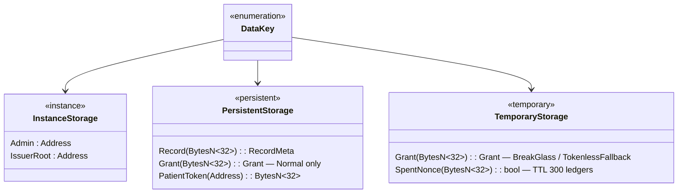
```mermaid
classDiagram
    class DataKey {
        <<enumeration>>
    }

    class InstanceStorage {
        <<instance>>
        Admin : Address
        IssuerRoot : Address
    }

    class PersistentStorage {
        <<persistent>>
        Record(BytesN~32~) : RecordMeta
        Grant(BytesN~32~) : Grant — Normal only
        PatientToken(Address) : BytesN~32~
    }

    class TemporaryStorage {
        <<temporary>>
        Grant(BytesN~32~) : Grant — BreakGlass / TokenlessFallback
        SpentNonce(BytesN~32~) : bool — TTL 300 ledgers
    }

    DataKey --> InstanceStorage
    DataKey --> PersistentStorage
    DataKey --> TemporaryStorage
```

### Key Security Invariants

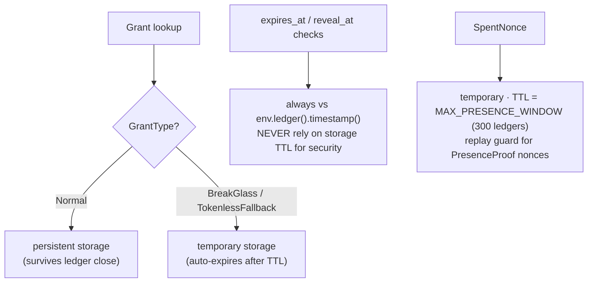
```mermaid
flowchart TD
    A["Grant lookup"] --> B{"GrantType?"}
    B -->|Normal| C["persistent storage\n(survives ledger close)"]
    B -->|BreakGlass / TokenlessFallback| D["temporary storage\n(auto-expires after TTL)"]

    E["expires_at / reveal_at checks"] --> F["always vs env.ledger().timestamp()\nNEVER rely on storage TTL for security"]

    G["SpentNonce"] --> H["temporary · TTL = MAX_PRESENCE_WINDOW (300 ledgers)\nreplay guard for PresenceProof nonces"]
```

### Record Registration & Patient Token (BKR-2)

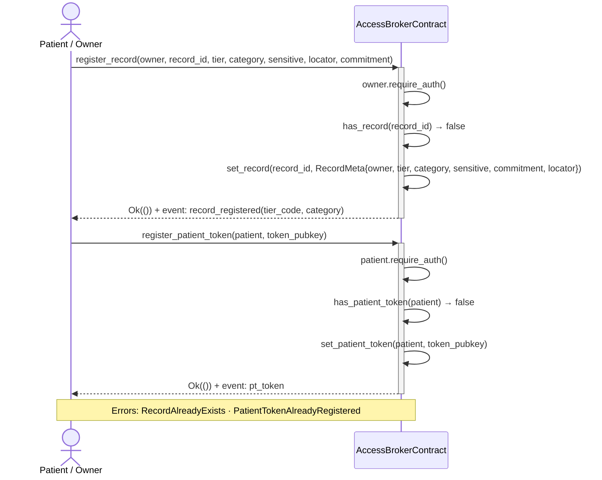
```mermaid
sequenceDiagram
    actor Owner as Patient / Owner
    participant AB as AccessBrokerContract

    Owner->>+AB: register_record(owner, record_id, tier, category, sensitive, locator, commitment)
    AB->>AB: owner.require_auth()
    AB->>AB: has_record(record_id) → false
    AB->>AB: set_record(record_id, RecordMeta{owner, tier, category, sensitive, commitment, locator})
    AB-->>-Owner: Ok(()) + event: record_registered(tier_code, category)

    Owner->>+AB: register_patient_token(patient, token_pubkey)
    AB->>AB: patient.require_auth()
    AB->>AB: has_patient_token(patient) → false
    AB->>AB: set_patient_token(patient, token_pubkey)
    AB-->>-Owner: Ok(()) + event: pt_token

    Note over Owner,AB: Errors: RecordAlreadyExists · PatientTokenAlreadyRegistered
```

### Normal Grant Creation (BKR-3)

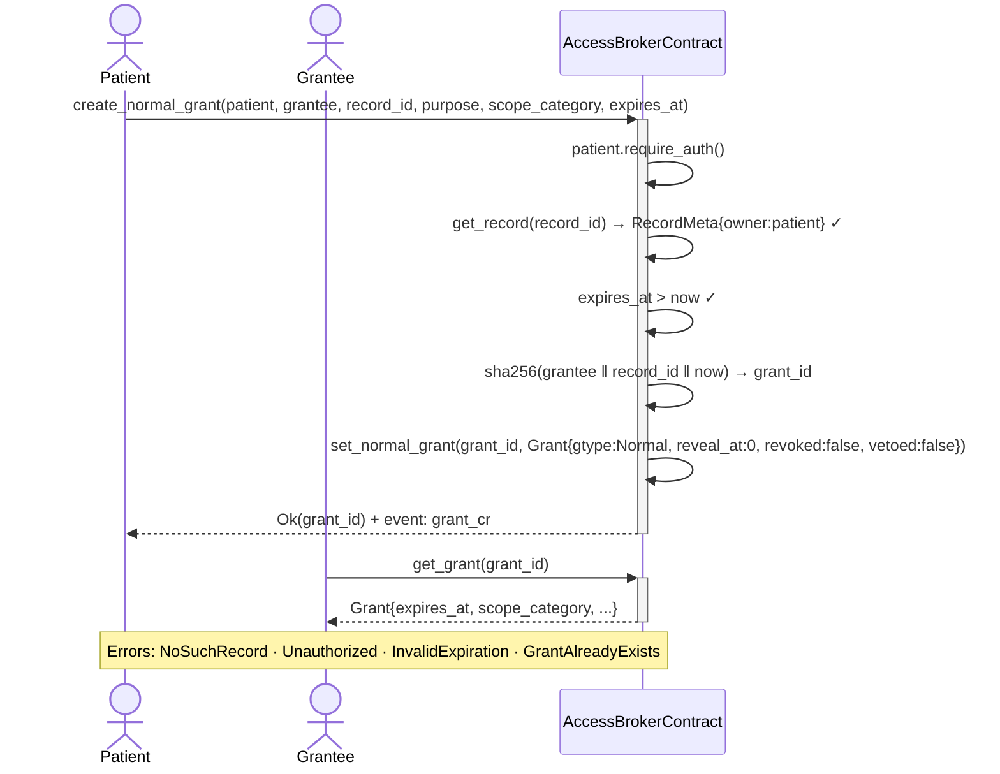
```mermaid
sequenceDiagram
    actor Patient
    actor Grantee
    participant AB as AccessBrokerContract

    Patient->>+AB: create_normal_grant(patient, grantee, record_id, purpose, scope_category, expires_at)
    AB->>AB: patient.require_auth()
    AB->>AB: get_record(record_id) → RecordMeta{owner:patient} ✓
    AB->>AB: expires_at > now ✓
    AB->>AB: sha256(grantee ‖ record_id ‖ now) → grant_id
    AB->>AB: set_normal_grant(grant_id, Grant{gtype:Normal, reveal_at:0, revoked:false, vetoed:false})
    AB-->>-Patient: Ok(grant_id) + event: grant_cr

    Grantee->>+AB: get_grant(grant_id)
    AB-->>-Grantee: Grant{expires_at, scope_category, ...}

    Note over Patient,AB: Errors: NoSuchRecord · Unauthorized · InvalidExpiration · GrantAlreadyExists
```

### Grant Revocation (BKR-3)

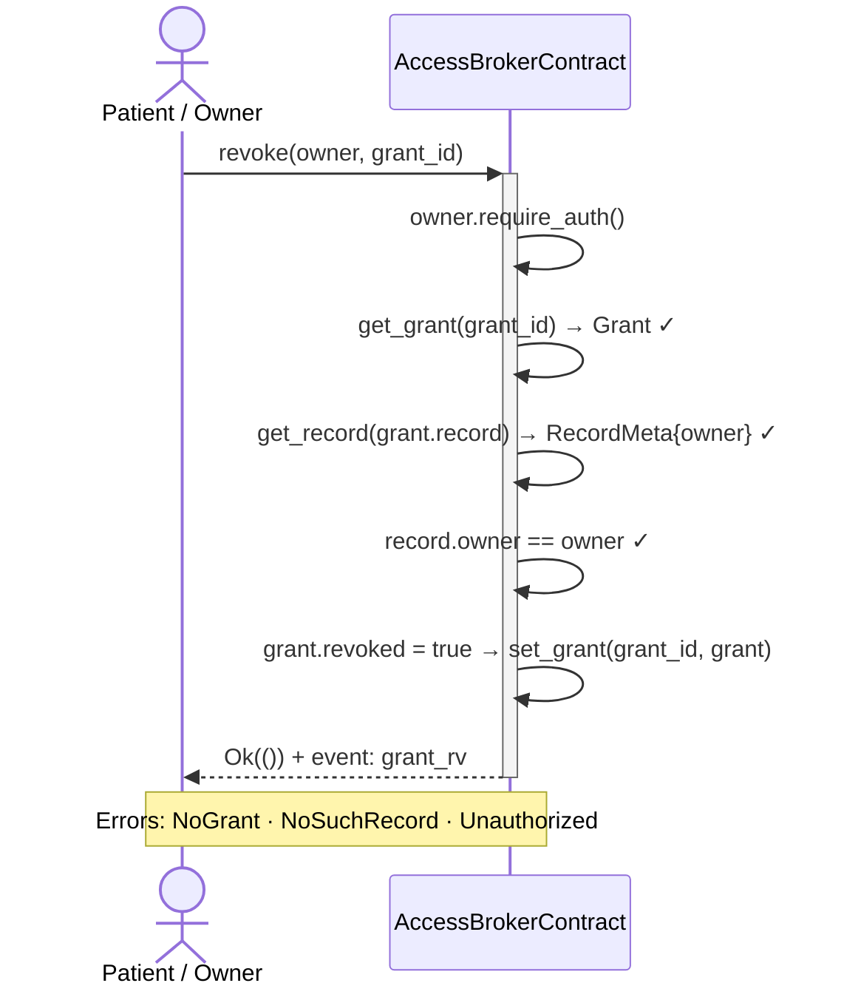
```mermaid
sequenceDiagram
    actor Owner as Patient / Owner
    participant AB as AccessBrokerContract

    Owner->>+AB: revoke(owner, grant_id)
    AB->>AB: owner.require_auth()
    AB->>AB: get_grant(grant_id) → Grant ✓
    AB->>AB: get_record(grant.record) → RecordMeta{owner} ✓
    AB->>AB: record.owner == owner ✓
    AB->>AB: grant.revoked = true → set_grant(grant_id, grant)
    AB-->>-Owner: Ok(()) + event: grant_rv

    Note over Owner,AB: Errors: NoGrant · NoSuchRecord · Unauthorized
```

### request_access — Happy Path (BKR-4)

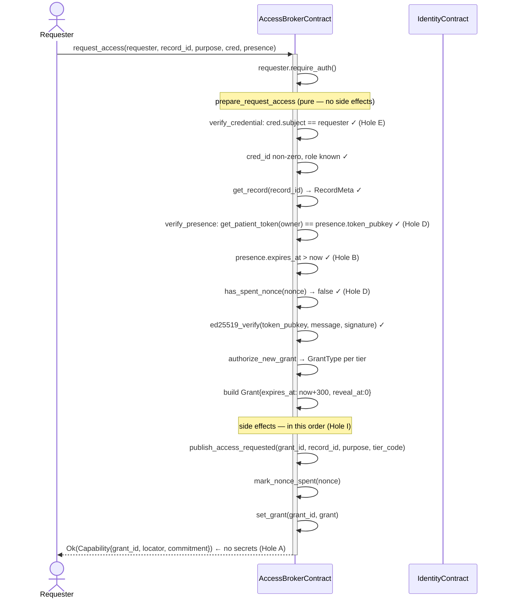
```mermaid
sequenceDiagram
    actor Requester
    participant AB as AccessBrokerContract
    participant ID as IdentityContract

    Requester->>+AB: request_access(requester, record_id, purpose, cred, presence)
    AB->>AB: requester.require_auth()

    Note over AB: prepare_request_access (pure — no side effects)
    AB->>AB: verify_credential: cred.subject == requester ✓ (Hole E)
    AB->>AB: cred_id non-zero, role known ✓
    AB->>AB: get_record(record_id) → RecordMeta ✓
    AB->>AB: verify_presence: get_patient_token(owner) == presence.token_pubkey ✓ (Hole D)
    AB->>AB: presence.expires_at > now ✓ (Hole B)
    AB->>AB: has_spent_nonce(nonce) → false ✓ (Hole D)
    AB->>AB: ed25519_verify(token_pubkey, message, signature) ✓
    AB->>AB: authorize_new_grant → GrantType per tier
    AB->>AB: build Grant{expires_at: now+300, reveal_at:0}

    Note over AB: side effects — in this order (Hole I)
    AB->>AB: publish_access_requested(grant_id, record_id, purpose, tier_code)
    AB->>AB: mark_nonce_spent(nonce)
    AB->>AB: set_grant(grant_id, grant)

    AB-->>-Requester: Ok(Capability{grant_id, locator, commitment}) ← no secrets (Hole A)
```

### request_access — Tier Authorization (BKR-4)

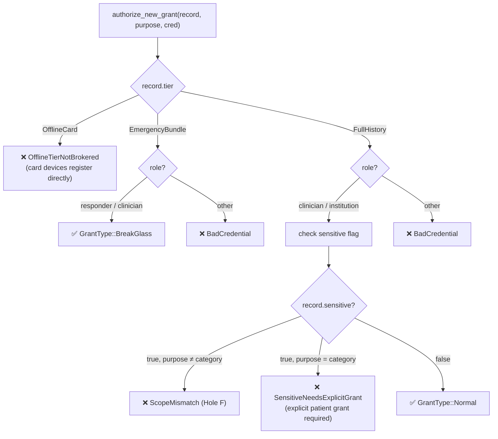
```mermaid
flowchart TD
    Start["authorize_new_grant(record, purpose, cred)"] --> T{"record.tier"}

    T -->|OfflineCard| OC["❌ OfflineTierNotBrokered\n(card devices register directly)"]

    T -->|EmergencyBundle| EB{"role?"}
    EB -->|responder / clinician| EBOk["✅ GrantType::BreakGlass"]
    EB -->|other| EBErr["❌ BadCredential"]

    T -->|FullHistory| FH{"role?"}
    FH -->|clinician / institution| FHRole["check sensitive flag"]
    FH -->|other| FHErr["❌ BadCredential"]

    FHRole --> Sens{"record.sensitive?"}
    Sens -->|true, purpose ≠ category| SM["❌ ScopeMismatch (Hole F)"]
    Sens -->|true, purpose = category| SEG["❌ SensitiveNeedsExplicitGrant\n(explicit patient grant required)"]
    Sens -->|false| FHOk["✅ GrantType::Normal"]
```

### request_access — Existing Grant Re-use (BKR-4)

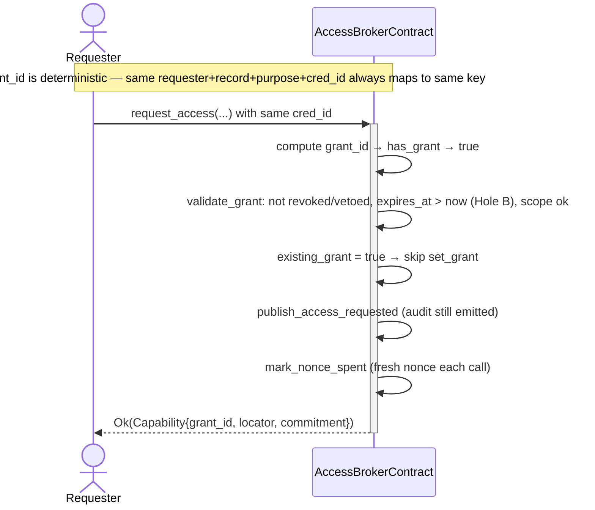
```mermaid
sequenceDiagram
    actor Requester
    participant AB as AccessBrokerContract

    Note over Requester,AB: grant_id is deterministic — same requester+record+purpose+cred_id always maps to same key
    Requester->>+AB: request_access(...) with same cred_id
    AB->>AB: compute grant_id → has_grant → true
    AB->>AB: validate_grant: not revoked/vetoed, expires_at > now (Hole B), scope ok
    AB->>AB: existing_grant = true → skip set_grant
    AB->>AB: publish_access_requested (audit still emitted)
    AB->>AB: mark_nonce_spent (fresh nonce each call)
    AB-->>-Requester: Ok(Capability{grant_id, locator, commitment})
```
